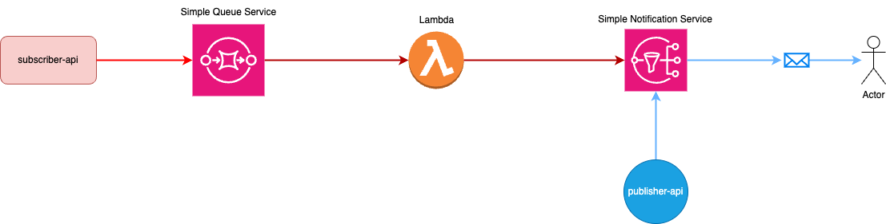

# Newsletter using Lambda, SQS e SNS

## Overview
Esse projeto é uma prova de conceito (POC) que visa demonstrar a implementação de um sistema robusto e escalável para o envio eficiente de newsletters. 

Vamos entender um pouco mais da stack e serviços escolhidos:

### Stack:

- Quarkus(Java 21)
- Python
- Amazon Notification Service
- Amazon Simple Queue Service
- Amazon Lambda

### 1. Por que serveless(Lambda)?

Na computação FaaS(Function as a Service), toda a infraestrutura é abstraída, e só é provisionada sob demanda.Os servidores ainda existem mas são abstraídos, e alocados dinamicamente, e gerenciada pelo provedor de serviços em nuvem

Dessa forma a função para o registro de novos assinantes só é executada quando a um novo registro na fila do sqs, sob demanda, ,economizando assim recursos e garantindo escalabilidade em casos de alta demanda.

### 2. Por que usar mensageria(SQS)?

O uso de mensageira garante permite que seja possível enviar, armazenar e receber mensagens entre componentes, garantindo assim a entrega das mensagens, a mensagem é armazenada até que seja consumida por algum componente.

No projeto é responsável por armazenar toda as mensagens de assinatura, garantindo assim que em caso de indisponibilidade de um dos componentes o usuário ainda será inscrito quando o ambientes estiver normalizado.

### 3. Por que usar o pub/sub(SNS)?

É um modelo de comunicação assíncrona, orientada a eventos,  que facilita a comunicação entre sistemas funcionais e distribuídos. As mensagens criadas são enviadas instantaneamente entre os sistemas conectados mas que atuam de forma independente.

Um dos recursos do SNS é justamente o push de email, quando um usuário assina uma newsletter, ele é inscrito em um tópico do SNS, e o SNS fica responsável por enviar a mensagem  para o cadastrado.

### System Design

